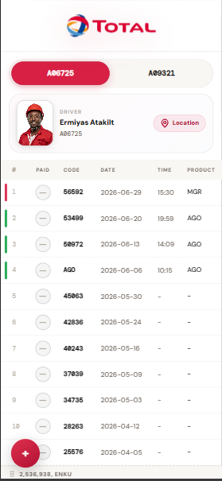
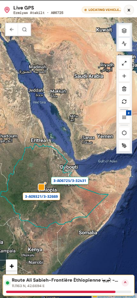
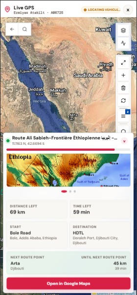

# 🚛 TruckTracker

### Real-time fuel fleet tracking from Addis Ababa to Doraleh — automated, intelligent, and built for the road.

  
  
  

<i>Live truck status, GPS route intelligence, and payment tracking — all in one place.</i>

---

## 📦 What is TruckTracker?

TruckTracker is a full-stack logistics platform built to solve a very real, very specific problem: **knowing exactly where your fuel tankers are, when they arrived, and whether you've been paid for the run** — without anyone manually chasing down information across WhatsApp groups, spreadsheets, and third-party GPS dashboards.

Built for a fleet of fuel tanker trucks running the **Bole/Addis Ababa → Doraleh Port** corridor, TruckTracker pulls arrival data in from multiple sources automatically, cross-references it against your fleet's license plates, and gives you a single live dashboard to track every truck's status — from departure to arrival to payment.

No more guessing. No more "did that truck even get there yet?" No more digging through old Excel files.

---

## ⚡ How Data Gets In — Three Ways

TruckTracker doesn't rely on one fragile pipeline. It's built with **three independent ingestion methods**, so data keeps flowing no matter which one is most convenient at the time.

### 🤖 1. WhatsApp Bot — Fully Automated
The Djibouti logistics center shares arrival manifests in a WhatsApp group with the on-the-ground gas station team. TruckTracker has a bot sitting in that group that:
- Watches incoming files (Excel or otherwise) the moment they're shared
- Scans them for your fleet's specific license plates
- Confirms an arrival the second a match is found
- Pushes the data straight into the database — zero manual work

### 📲 2. iOS Shortcut — Share-to-Track
Built for the field team running iPhones. A custom **iOS Shortcut** turns a simple "Share" action into a full data pipeline:
- Download once from the site, and it configures itself automatically
- From then on, sharing a file feels exactly like sharing to an app — even though it's a native iOS Shortcut under the hood
- Sends data through the same API the WhatsApp bot uses, so everything lands in one unified database

### ✍️ 3. Manual Entry / Manual Upload
For everything else — direct file upload or hand-entry when the information comes in some other way. Full control, when you need it.

---

## 🖥️ The Dashboard — Where It All Comes Together

Once data lands, the web app (a installable **PWA** — works like a native app, no app store needed) gives you a clean, mobile-first view of your entire fleet:

- 📋 **Truck code, dates, and live status** at a glance
- 💰 **Paid / unpaid tracking** for every completed run
- ✏️ **Full edit & delete control** over every record
- 🔄 **Duplicate detection** so the same arrival never gets logged twice
- 📱 **Mobile-first design** with pull-to-refresh, built for use on the move

---

## 🛰️ Live GPS Intelligence — Beyond a Basic Map

Every truck has its own driver and its own GPS unit, supplied through a partnership with a third-party fleet tracking provider. Their stock dashboard, on its own, wasn't enough — so TruckTracker takes it much further:

- **Custom API integration** — we requested and received direct API access to pull richer, more granular vehicle data than their default site exposes
- **Automated extraction layer** — a headless browser pipeline (via Puppeteer) continuously runs and scrapes the provider's own dashboard for the specific data points their API doesn't cover, on a constant refresh cycle
- **Embedded live view** — the provider's own tracking interface is embedded directly inside TruckTracker (iframe) so you never have to leave the app, while all of our *additional* intelligence is layered on top
- **Enriched vehicle + location detail** — extended engine, location, and route data beyond what the stock provider dashboard shows
- **Computer vision support** — Google Vision integration assists with image-based data extraction where needed

The result: one screen that shows you everything — your own data, *and* the GPS provider's data — without juggling two different tools.

---

## 🧰 Built With

| Layer | Tech |
|---|---|
| Frontend | React (PWA) |
| Backend | Node / Express |
| Database | Supabase |
| Automation | Puppeteer, WhatsApp Bot |
| Vision | Google Vision API |
| Hosting | Render, Vercel (backup) |

---

## 🎯 Why It Matters

Every truck on this route represents real fuel, real time, and real money. TruckTracker exists so that nothing falls through the cracks between a WhatsApp message in Djibouti and a payment record back home — turning a process that used to live across group chats and spreadsheets into one live, accurate, always-up-to-date system.

---

## 🔒 A Note on Access

This repository is shared as a **showcase / prototype overview** — it walks through the architecture and feature set of TruckTracker, but it is **not the live, fully accessible codebase**. The production project is kept **private** for security reasons, since it handles real fleet, payment, and partner data.
Any data, screenshots, or examples shown here are **sample/demo data only** and do not reflect actual fleet records, license plates, or financial information.
If you're interested in the full project or a deeper technical walkthrough, feel free to reach out directly.

